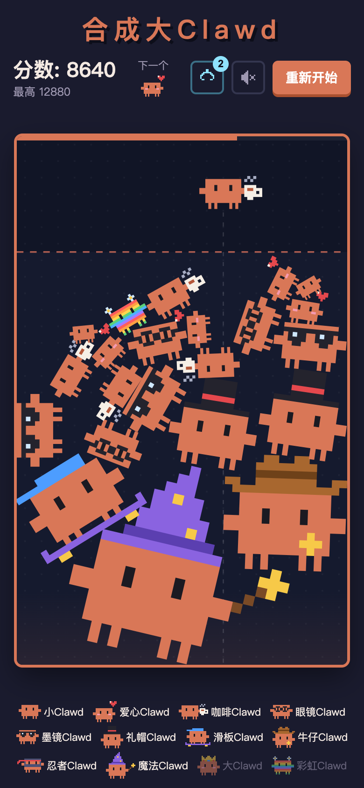
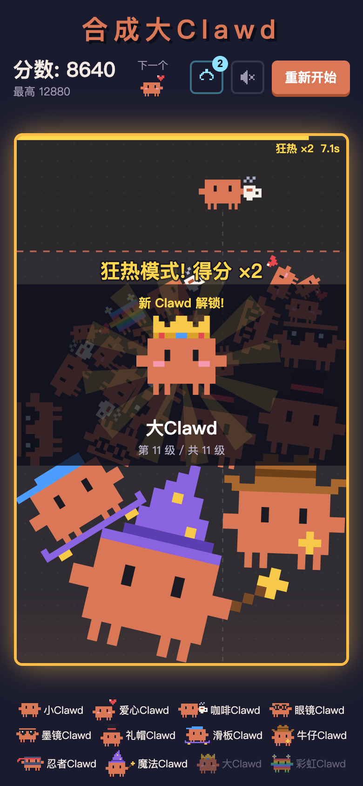
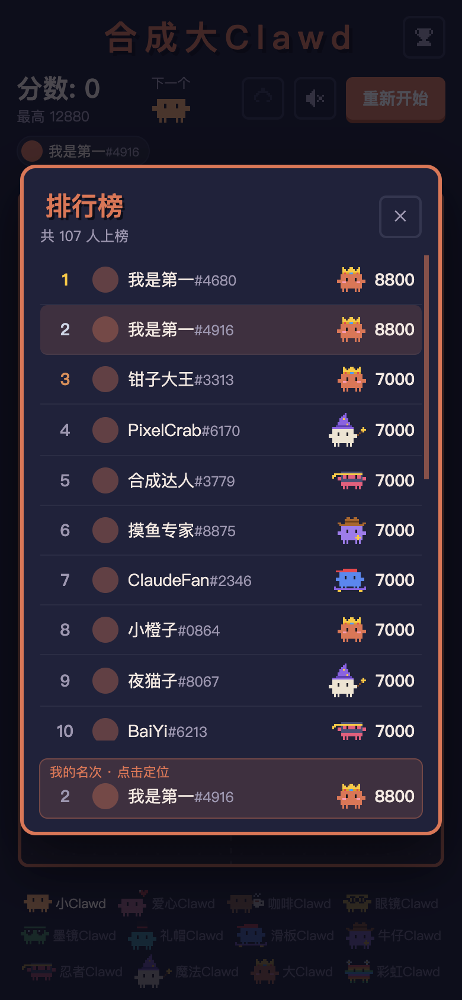

# 合成大Clawd · Clawd Merge

**把两只一样的像素小 Clawd 碰在一起，合成更大的 Clawd，直到合出戴王冠的大Clawd。**

简体中文 | [English](#english)

一个「合成大西瓜」式的物理合成小游戏，主角是 Claude 的橙色像素小螃蟹 Clawd。11 级 Clawd 各有各的小配件：爱心、咖啡、墨镜、礼帽、滑板、魔法帽……

整个项目**零依赖、零构建**：原生 ES Module + Canvas，物理引擎是手写的，打开网页就能玩；排行榜是一个同样零依赖的 Cloudflare Worker。

**▶ 在线试玩：<https://tsdsj.github.io/clawd-merge/>**（手机、电脑都可以）

<table>
  <tr>
    <td></td>
    <td></td>
    <td></td>
  </tr>
</table>

---

## 目录

- [怎么玩](#怎么玩)
- [11 只 Clawd](#11-只-clawd)
- [特殊机制](#特殊机制)
- [计分与难度](#计分与难度)
- [排行榜](#排行榜)
- [本地运行](#本地运行)
- [部署](#部署)
- [技术实现](#技术实现)
- [仓库结构](#仓库结构)
- [声明与许可](#声明与许可)

---

## 怎么玩

| | 手机 | 电脑 |
| --- | --- | --- |
| 瞄准 | 按住棋盘左右拖动 | 鼠标移动，或 ← / → (A / D) |
| 投放 | 松手 | 点击，或 空格 / ↓ |
| 钳子 | 点右上角钳子按钮，再点一只 Clawd | 同左，或按 C |
| 暂停／继续 | 「暂停」「继续游戏」按钮 | 同左，或按 P |
| 重开 | 「重新开始」按钮 | 同左，或按 R |

- 两只**同级**的 Clawd 碰到一起，会合成为下一级。
- 落稳的 Clawd 堆过红色虚线并停留 3 秒，游戏结束（警戒线下方会显示倒计时；被大合成炸飞、还在空中的 Clawd 不算）。
- 只会掉落最小的 5 种 Clawd；越往后，大一点的掉得越多。
- 手机横屏也能玩，还可以「添加到主屏幕」当 App 用。
- 查看排行榜、账号、身份选择或玩法说明时游戏自动暂停；关闭后回到原状态，不会解除之前的手动暂停。
- 进行中的对局切后台或窗口失焦后，返回需要点「继续游戏」；物理、危险倒计时、狂热与冷却均暂停，恢复不会自动补投。
- 已有投放的未结束对局重开需确认，取消保留原局；空局或结束后可直接重开。本机最高分、图鉴和账号不会因重开清除。
- **断点续玩**：当前浏览器自动保留一份未完成对局，按 API 环境隔离。刷新后可恢复棋盘、分数、当前／下一只、道具和倒计时；新开前需确认。以界面最近一次「已保存」为准，不保证系统强杀前最后一帧无损。
- 在线旧局恢复会只读核验原账号与凭证，不会续签。过期、换账号或断网时，可以明确选择转为本地继续；降级后不再补交。结束时先保留成绩结果，再清理未完成棋盘，防止刷新把结束局误恢复。
- 同一存档仅一个标签页写入；接管需原页暂停、保存并释放，原页无响应时关闭后重试。存档坏了不会自动删除；存储或浏览器互斥能力不可用时会提示临时游玩。自动存档需要支持 Web Locks 和 BroadcastChannel 的安全环境（HTTPS 或 localhost）；普通局域网 HTTP 页面可能只能临时游玩。

## 11 只 Clawd

| 级 | 名字 | 颜色 | 特征 | 级 | 名字 | 颜色 | 特征 |
| --- | --- | --- | --- | --- | --- | --- | --- |
| 1 | 小Clawd | 杏色 | 最小的 Clawd | 7 | 滑板Clawd | 蓝 | 红色棒球帽 + 滑板 |
| 2 | 爱心Clawd | 粉 | 腮红 + 小爱心 | 8 | 牛仔Clawd | 紫 | 牛仔帽 + 警长星 |
| 3 | 咖啡Clawd | 焦糖 | 端着一杯热咖啡 | 9 | 忍者Clawd | 玫红 | 金色头巾 + 面罩 |
| 4 | 眼镜Clawd | 黄 | 圆框眼镜 | 10 | 魔法Clawd | 奶白 | 巫师帽 + 魔杖 |
| 5 | 墨镜Clawd | 绿 | 酷酷的墨镜 | 11 | 大Clawd | **Claude 橙** | 宝石王冠 |
| 6 | 礼帽Clawd | 青 | 绅士礼帽 | ★ | 彩虹Clawd | 彩虹 | 稀有万能牌 |

每一级都有自己的颜色，一眼就能认出来；只有合到最后的大Clawd 才是 Claude 官方的橙色。
没合成过的 Clawd 在图鉴里是「???」剪影，第一次合出来会弹出解锁卡片。

## 特殊机制

| 机制 | 说明 |
| --- | --- |
| **连击** | 1.2 秒内连续合成算连击，每连一次得分 +25%，最高 ×2 |
| **狂热模式** | 合成会充满棋盘顶部的能量条，满了进入 8 秒狂热，得分 ×2 |
| **彩虹Clawd** | 稀有掉落，碰到谁就让谁直接升一级 |
| **钳子** | 每局第一次合出 7 级及以上的每一级，各奖励一个钳子（最多存 3 个），可以夹走任意一只 Clawd |
| **两只大Clawd** | 合在一起会「升天」，得到一大笔奖励分 |

## 计分与难度

两只 k 级 Clawd 合成得 **2^k** 分：合出高级 Clawd 靠的是规划，所以值的分远比低级连锁多。

难度是用模拟玩家反复调出来的：

| 模拟玩家 | 平均分 | 平均投放次数 |
| --- | --- | --- |
| 一直点同一个位置 | ~6,000 | 149 |
| 随机乱点 | ~4,600 | 131 |
| 简单策略（找同级） | ~9,700 | 162 |
| 预判落点（每次模拟 12 个位置） | ~24,000 | 231 |

一直点同一个位置的玩家，分数只有会规划的玩家的四分之一左右。

## 排行榜

- 第一次进入**不用登录或起名就能玩**。前三次投放提供可关闭的轻提示，点 `?` 可以随时查看玩法。
- 想参与排名时，点「加入排行榜」：**用 LINUX DO 登录**（名字就是 L 站用户名，换设备最佳成绩不丢），或者**当游客**随便起名（可以重名，自动带 `#编号`，只保存在当前浏览器）。
- 未加入的对局只保留本机最佳成绩，不上榜；中途起游客名不会重置棋盘，也不能补交旧局，从下一局开始申请成绩凭证。局中跳转 LINUX DO 会离开页面，建议打完后再登录。
- 已有身份开局会显示连接状态，拿到凭证才显示「本局参与排名」；连接失败或登录失效仍可本地游玩。退出／切换身份不会把当前局转交给新账号。
- 游客之后登录 L 站，成绩会合并到 L 站账号；点左上角的名字可以改名、绑定 L 站或退出。
- 每人只计最佳成绩；游戏结束时显示你的全球排名。
- **可靠补传**：在线成绩先在本机暂存，响应丢失也保留记录。同一凭证、同一内容重复提交只记一次；不同内容不能覆盖。结算显示提交时的最佳排名，最新名次看排行榜。
- 请求超时为 8 秒，一次触发最多首次请求加 3 次自动重试（约 2、5、15 秒）；429 遵守服务器等待时间。预算用完后暂停自动重试，刷新不会无限重置预算，可在「待处理成绩」里手动重试。
- 成绩只用原身份补传；游客绑定或退出前须先完成、或明确移除待处理记录。本机写入失败会提示「尚未保存，请勿刷新」。可以继续玩；若结束记录尚未安全转入队列，新局会明确标记为临时游玩。
- 每个 API 环境最多保留 50 条持久化待处理记录，不静默淘汰旧结果。移除本机记录需确认，不会删除服务器已经接受的成绩。本地局、缺少原凭证的局、主动降级为本地的局不能补交。
- 后端是 Cloudflare Workers + D1，自带防刷校验。部署方法见 [`leaderboard/README.md`](leaderboard/README.md)。
- 没配置排行榜地址（[`src/config.js`](src/config.js)）时，游戏照常单机运行。

## 本地运行

需要 Node 22.13+，**不用 `npm install`**。

```bash
npm start
```

打开 <http://localhost:5173>；同一 Wi-Fi 下的手机可以用终端打印的局域网地址访问。

| 命令 / 地址 | 作用 |
| --- | --- |
| `?debug` | 在网址后加上，显示每只 Clawd 的碰撞体 |
| `npm test` | 运行核心玩法、排行榜接口与客户端可靠性回归测试 |
| `npm run test:http` | 真实请求超时集成检查（约 16 秒） |
| `MINIFLARE_MODULE=/path/to/miniflare npm run test:d1` | 使用独立安装的 Miniflare 做本地 workerd/D1 集成检查 |
| `/test/performance.html` | 固定种子的浏览器 Canvas 性能测量页，不上传成绩 |
| `npm run lb:dev` | 启动本地排行榜 API（D1 用 Node 自带 SQLite 模拟），配合 `?api=http://localhost:8787` 使用 |
| `npm run icons` | 重新生成主屏幕图标 |

`?api=` 仅在 `localhost`、`127.0.0.1` 或 `[::1]` 页面生效，目标必须是这些 loopback 主机的 HTTP(S) origin（可以带端口，不能带账号密码、路径、查询或 fragment）。线上和局域网 IP 页面忽略该参数，使用配置的 API。局域网手机访问仍可游玩，但不能通过参数切换到本地 API。

本地调试身份按 API 地址隔离，不读取旧的共享身份键；升级后本地调试需要重新登录或注册。线上现有登录保持兼容。

自动回归由 `.github/workflows/ci.yml` 执行；本地证据与未关闭的发布检查见 [M1 / T07 检查报告](docs/verification/m1-t07.md)。

## 每日挑战（M2 已发布）

默认仍直接进入经典模式，可切换到每日挑战练习。每题 100 投，最后一投后停止道具操作，落稳持续 0.75 秒或达到 8 秒结算上限后结束。经典与挑战分别保存；练习结果不改经典最高分、图鉴或排行榜。

M2 已接入服务器日题、正式机会与独立今日榜：游客与 LINUX DO 身份均为每日 3 次正式机会（绑定时累计已用次数），练习不限；旧题须在次日北京时间 00:10 前提交。开局重试不重复扣次，结算结果可可靠补传；没有服务器题目时可练习已有缓存。

开发验证见 [T10 记录](docs/verification/m2-t10.md)，线上发布与验收范围见 [M2 发布记录](docs/verification/m2-release.md)。本地开发可启动 `npm run lb:dev`，并使用 loopback API 参数连接。

## 部署

- **游戏**：仓库根目录就是网站。在 GitHub 仓库的 Settings → Pages 里选 `Deploy from a branch` → `main` / `(root)`。
- **排行榜**：见 [`leaderboard/README.md`](leaderboard/README.md)。

## 技术实现

- **物理引擎**（[`src/physics.js`](src/physics.js)）：每只 Clawd 是一组圆组成的刚体，包括帽子、咖啡杯、滑板等配件的碰撞圆，所以滚到墙边也不会被边框挡住。求解器用 sequential impulse，带 warm starting 和独立的位置修正；静止的一堆 Clawd 会按「岛」整体休眠，不会抖动蠕动。
- **像素画**（[`src/crabs.js`](src/crabs.js)）：所有 Clawd 都是 ASCII 字符画，运行时按屏幕分辨率栅格化并缓存，没有任何图片素材。
- **音效**（[`src/audio.js`](src/audio.js)）：WebAudio 实时合成的 8-bit 音效，合成音高随等级和连击升高。

## 仓库结构

```
├── index.html            页面
├── src/
│   ├── main.js           布局、输入、主循环、排行榜界面
│   ├── game.js           游戏规则（RULES）、合成、特效、渲染
│   ├── physics.js        刚体物理引擎
│   ├── crabs.js          11 级 Clawd 的像素画和碰撞体
│   ├── audio.js          音效
│   ├── leaderboard.js    排行榜客户端
│   ├── game-state.js     版本化棋盘快照、校验与恢复
│   ├── save-store.js     存档读写与跨标签页互斥交接
│   ├── save-flow.js      恢复选择、资格降级与保存状态
│   ├── outbox.js         成绩持久化队列、有限重试、上传互斥
│   ├── score-result.js   不可变结果与回执校验
│   ├── upload-ui.js      结算上传状态与待处理入口
│   ├── storage.js        可失败的本机设置存储
│   ├── config.js         排行榜 API 地址
│   └── style.css
├── leaderboard/          排行榜后端（Cloudflare Worker + D1）
├── scripts/make-icons.mjs  生成 PNG 图标（零依赖）
├── icons/  docs/         图标、README 截图
└── serve.mjs             本地静态服务器
```

## 声明与许可

- Clawd 是 Anthropic 的 Claude Code 吉祥物。本项目是粉丝自制的小游戏，**与 Anthropic 无关**，也未获其背书。
- 代码以 [MIT](LICENSE) 协议开源。
- 感谢 [LINUX DO](https://linux.do) 社区的佬友们。

---

<a id="english"></a>

# 合成大Clawd · Clawd Merge (English)

**Merge two identical pixel Clawds into a bigger one, all the way up to the crowned Big Clawd.**

A Suika-style ("合成大西瓜") physics merge game starring Clawd, Claude's orange pixel crab. It has **no dependencies and no build step**: native ES modules, Canvas and a hand-written physics engine. The leaderboard is a Cloudflare Worker, also dependency-free.

**▶ Play: <https://tsdsj.github.io/clawd-merge/>** (phone or desktop)

## How to play

- **Phone**: drag to aim, release to drop. **Desktop**: mouse or ← / →, click or Space to drop.
- Two Clawds of the same level merge into the next level. If the settled pile stays above the red dashed line for 3 s (a countdown is shown; Clawds still flying after a big merge don't count), the game is over.
- Press P or use Pause/Continue. Dialogs pause the game without overriding an existing manual pause. Returning from the background or window blur requires explicit continuation; queued inputs are cleared. Restarting an unfinished game with drops requires confirmation; empty or finished games restart directly.
- One unfinished game is autosaved per browser/API environment. Reload to resume from the last successful save. Online restoration checks the original identity and session without renewing it; explicitly choosing local play permanently removes that game's ranking eligibility. Tabs hand off exclusive ownership before continuing. Unsupported storage/locking falls back to clearly labelled temporary play; completed games are not offered for restoration.
- Online results are durably staged before unfinished saves are cleared. A bounded retry queue survives reloads and only uploads under the original identity. Requests time out after 8 seconds, with up to three automatic retries per trigger; server rate limits are respected. Identical submissions replay an immutable receipt without counting another game. Storage failures are shown explicitly, and removing a local record never deletes an accepted server score.
- The 11 levels: Baby → Heart → Coffee → Glasses → Shades → Top hat → Skateboard → Cowboy → Ninja → Wizard → Big Clawd (crown). Every level has its own body colour; only the final Big Clawd wears the official Claude orange. A rare **Rainbow Clawd** upgrades whatever it touches.

## Mechanics

| Mechanic | What it does |
| --- | --- |
| Combo | Merges within 1.2 s chain: +25% each, capped at ×2 |
| Fever | Merges fill a meter; when it's full, you get 8 s of double score |
| Claw | Earned the first time per game you create each level ≥ 7 (max 3). Tap a Clawd to remove it |
| Collection | Unseen Clawds show as silhouettes; the first time you create one, an unlock card pops up |

Scoring: merging two level-k Clawds scores **2^k**. Balance was tuned with simulated players. Clicking one spot averages ~6k; a lookahead player averages ~24k.

## Leaderboard

Start playing immediately without an account. A dismissible first-run guide explains the controls; the `?` button opens the rules. To rank future games, join with LINUX DO (your forum username, works across devices) or choose a guest name (duplicates allowed, shown with a `#1234` tag). Joining midway keeps the current board but does not upload that local game; ranking starts with the next game after a session ticket is received. Failed connections or expired logins never block local play. Each player's best score is ranked. The backend is Cloudflare Workers + D1, with single-use game sessions, plausibility checks on elapsed time and score, and rate limits. See [`leaderboard/README.md`](leaderboard/README.md) to deploy it, then set `LEADERBOARD_API` in [`src/config.js`](src/config.js). Without it, the game runs offline.

## Run locally

```bash
npm start        # http://localhost:5173  (Node 22.13+, no npm install)
npm test         # gameplay and leaderboard regression tests
npm run lb:dev   # local leaderboard API → open the game with ?api=http://localhost:8787
```

API overrides work only on loopback pages (`localhost`, `127.0.0.1`, `[::1]`) and accept only loopback HTTP(S) origins. Production and LAN-IP pages ignore the override. Local identities are scoped to the API address; legacy local identities require signing in again. Existing production logins are preserved.

Add `?debug` to the URL to see collision shapes.

## Under the hood

- **Physics**: compound-circle rigid bodies. Accessories get their own circles, so props never clip through walls. The solver uses sequential impulses with warm starting plus a position-correction pass, and island sleeping keeps resting piles perfectly still.
- **Art**: every Clawd is ASCII pixel art, rasterised at the screen's resolution. There are no image assets.
- **Audio**: 8-bit sound effects synthesised live with WebAudio.

## Disclaimer & license

Clawd is Anthropic's mascot for Claude Code. This is an unofficial fan game, **not affiliated with or endorsed by Anthropic**. Code is released under the [MIT](LICENSE) license. Thanks to the [LINUX DO](https://linux.do) community.

M2 支持每日挑战结果的本地 PNG 分享卡及同题链接：旧题只练习，目标分不作为官方成绩证明。支持平台可调用系统分享，其他平台可保存图片或复制链接；详情见 [T11 验证记录](docs/verification/m2-t11.md)及 [M2 发布验收](docs/verification/m2-release.md)。
